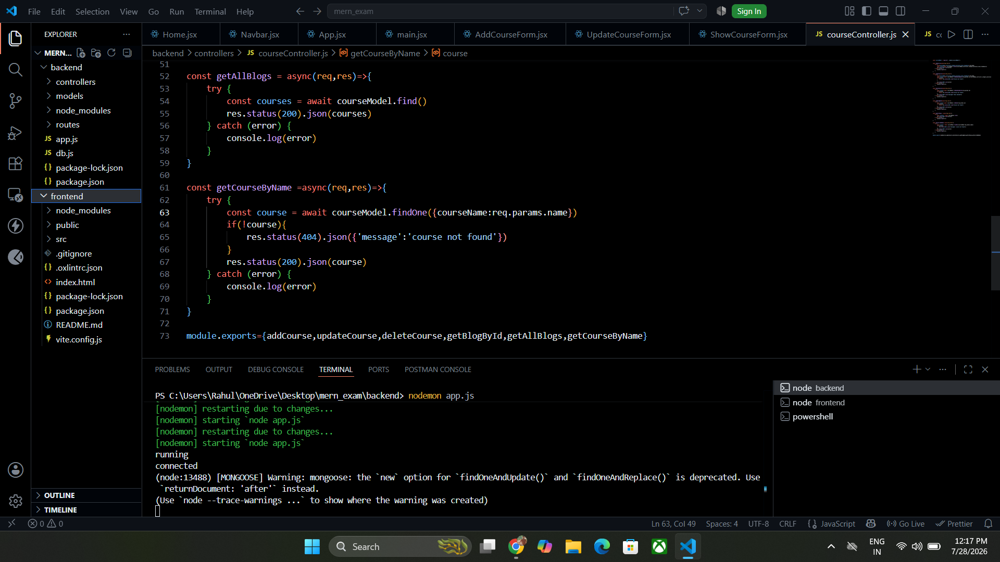
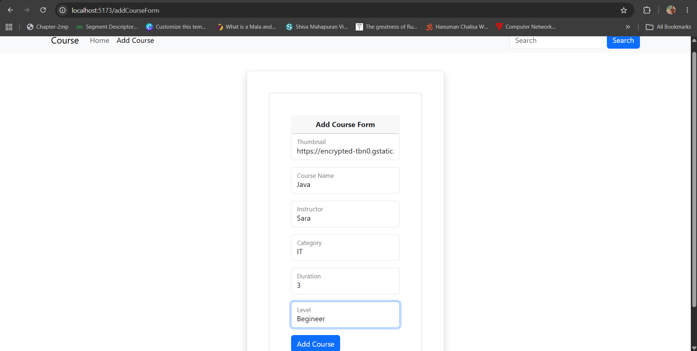
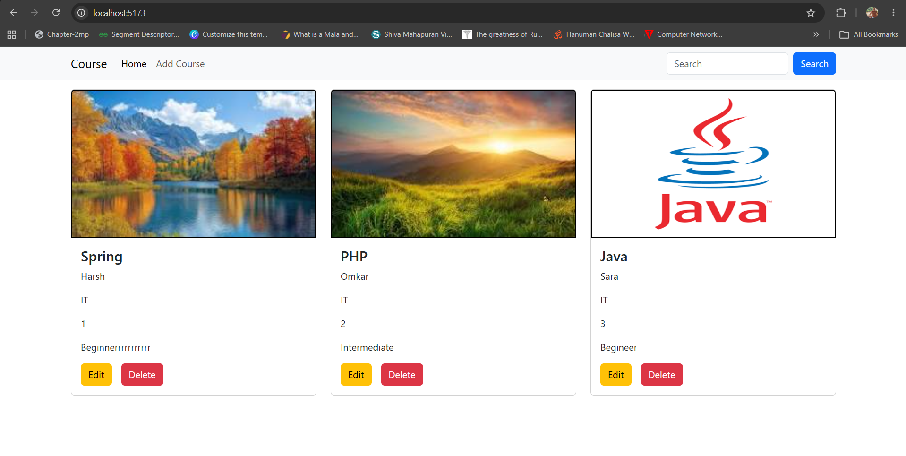
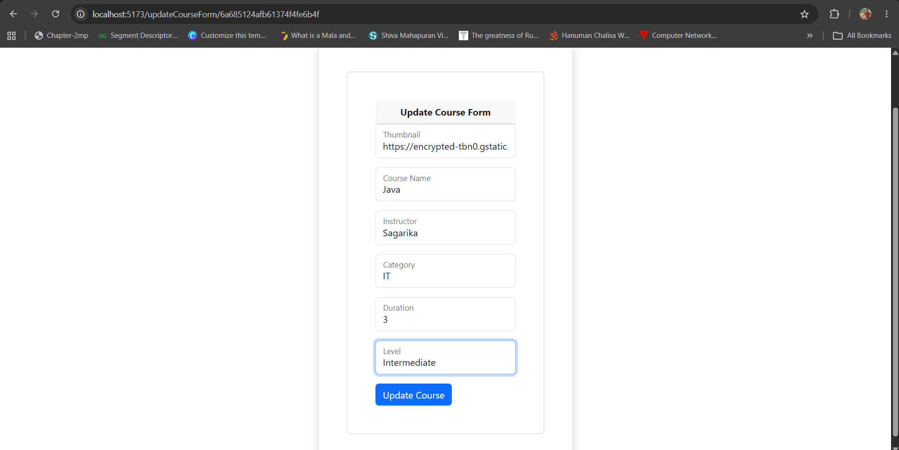
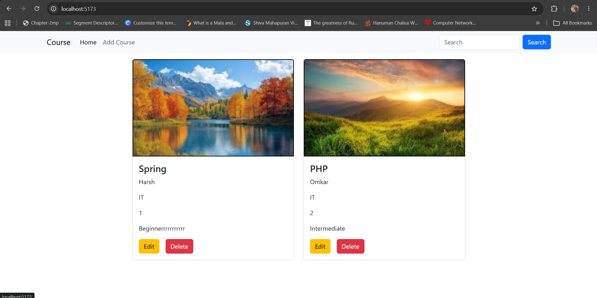
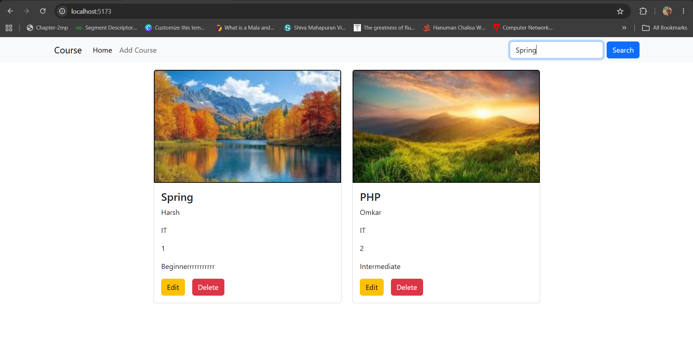
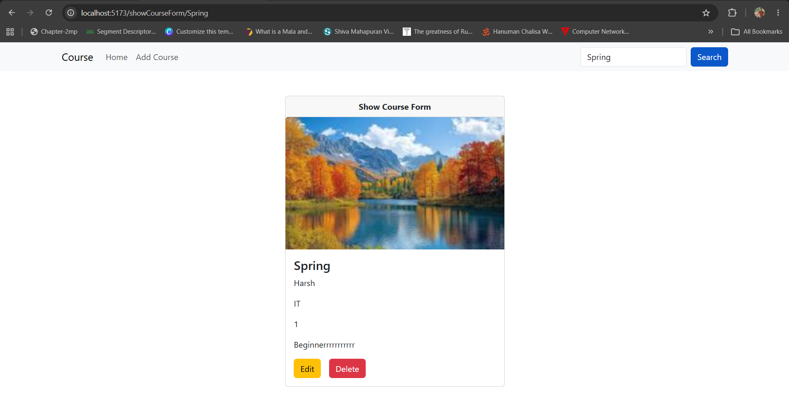

# MERN Course Management System

A full-stack **Course Management System** built using the **MERN Stack (MongoDB, Express.js, React.js, Node.js)**. This application allows users to perform CRUD operations on courses and search courses by name.

---

## Features

- Add a new course
- View all courses
- Update course details
- Delete a course
- Search course by name
- Responsive Bootstrap UI
- REST API using Express.js
- MongoDB database integration

---

## Tech Stack

### Frontend
- React.js
- React Router DOM
- Axios
- Bootstrap 5

### Backend
- Node.js
- Express.js

### Database
- MongoDB
- Mongoose

---

## Project Structure

```
mern_exam
│
├── backend
│   ├── controllers
│   ├── models
│   ├── routes
│   ├── app.js
│   └── db.js
│
└── frontend
    ├── src
    ├── screenshots
    ├── public
    └── README.md
```

---

# Application Screenshots

## 1. Home Page

Displays all available courses.



---

## 2. Add Course

Course creation form.



---

## 3. After Adding Course

Successfully added course displayed on the home page.



---

## 4. Update Course

Course update form.



---

## 5. After Updating Course

Updated course information displayed.


---

## 6. After Deleting Course

Course removed successfully.



---

## 7. Search Course

Searching for a course by its name.



---

## 8. Search Result

Course details displayed after successful search.



---

## Installation

### Clone the repository

```bash
git clone <repository-url>
```

### Backend

```bash
cd backend
npm install
npm start
```

### Frontend

```bash
cd frontend
npm install
npm run dev
```

---

## API Endpoints

| Method | Endpoint | Description |
|--------|----------|-------------|
| POST | `/addCourse` | Add a new course |
| GET | `/getAllCourses` | Get all courses |
| GET | `/getCourseById/:id` | Get course by ID |
| GET | `/getCourseByName/:name` | Search course by name |
| PATCH | `/updateCourse/:id` | Update a course |
| DELETE | `/deleteCourse/:id` | Delete a course |

---

## Author

**Harshvardhan Gupta**